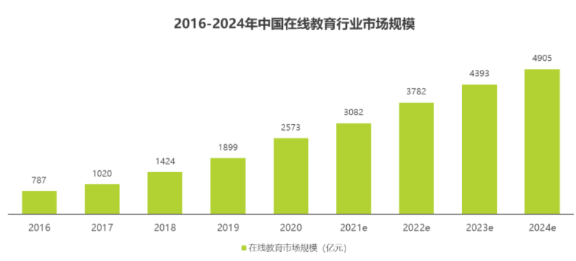
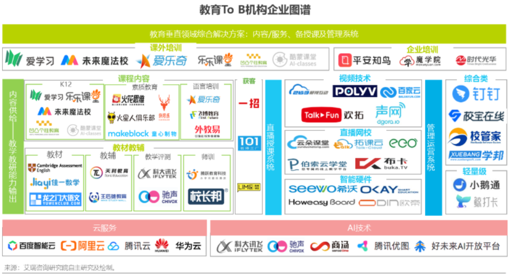
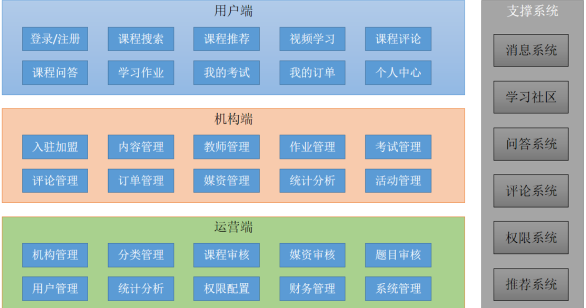
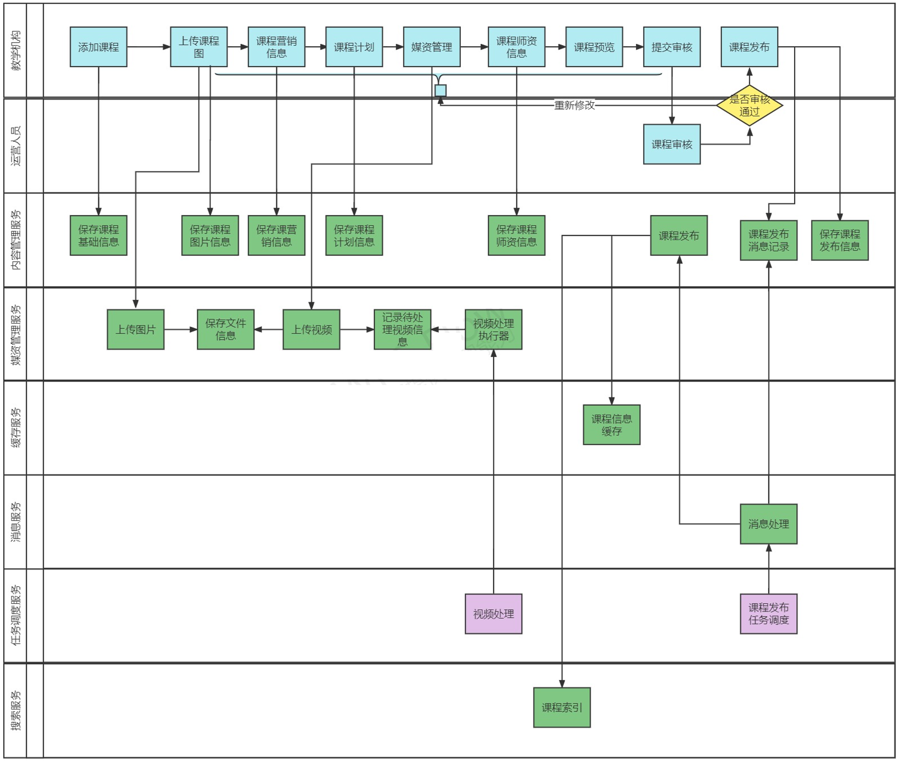

# 专业课透明计划

####  从零开始

​		本项目的想法来源自我考研结束的时候，当时我的专业课成绩比较高，有培训机构联系我让我给下一届的考研学生上一对一辅导， 后来和学生沟通了解到我挣到课时费还没有他交的学费的一半多，差价都让培训机构赚了，所以产生了想要创建平台构建考研学生和已上岸的师兄师姐们的联系，消除中间商赚差价。

​		前期通过市场调研发现，2020年中国在线教育行业市场规模2573亿元，过去4年的CAGR达34.5%， 2020年后，疫情冲击下，更加加快了在线教育的进程。

​		疫情也加速了整个教育产业链的进化，to B机构快速成长起来，扮演着赋能者的角色，课程内容、招生、师训、直播系统、管理系统等产品及服务大量涌现。 随着云服务发展成熟以及疫情对直播课需求的催化，大量提供直播授课系统等PaaS/SaaS服务的机构迅速成长起来，成为各种会展上的主力军。

​		而专门针对考研专业课辅导的平台暂未出现，而每年考研的人数都在不断增加，因此本项目有着很好的前景。

#### 介绍

​		本项目是本人自研的一个专门针对考研专业课教育的网络课堂系统，意在提供各大高校热门专业的专业课辅导课程，授课人群为各大高校已上岸的学长学姐。

​		 本项目基于B2B2C的业务模式，培训机构（即专业课高分学长学姐）可以在平台入驻、发布课程，运营人员对发布的课程进行审核，审核通过后课程才可以发布成功， 课程包括免费和收费两种形式，对于免费课程可以直接选课学习，对于收费课程在选课后需要支付成功才可以继续学习。

​		目前本项目已经完成了后端的内容管理模块、媒资管理模块、课程发布模块，后续还有课程搜索模块、支付模块等。

​		有前端经验以及对本项目感兴趣的同学可以联系我：193-0252-1338。

#### 软件架构

项目预期业务框架图：

已完成的课程编辑与发布流程如下图：

#### 参与贡献

1. Fork 本仓库
2. 新建 Feat_xxx 分支
3. 提交代码
4. 新建 Pull Request

